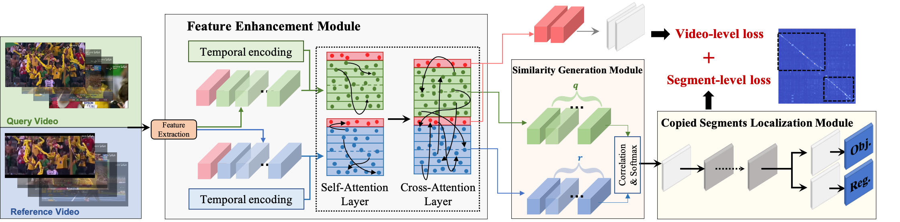

# TransVCL: Attention-enhanced Video Copy Localization Network with Flexible Supervision [AAAI2023 Oral]

## Introduction
TransVCL is a novel network with joint optimization of multiple components for segment-level video copy detection. It achieves the state-of-the-art performance in video copy segment localization benchmark and can also be flexibly extended to semi-supervised settings. This paper is accepted by AAAI2023. The details of TransVCL are indicated in [arXiv Link](https://arxiv.org/abs/2211.13090).


## Preparations
* Download or extract frame-level video features and put them under directory `data/${DATASET}/features/`.
Features of VCSL dataset are given in [VCSL benchmark](https://github.com/alipay/VCSL), and features of VCDB dataset need 
to be extracted following [ISC competition](https://github.com/lyakaap/ISC21-Descriptor-Track-1st).
* Download our pretrained model in `transvcl/weights/pretrained_models.txt`.  We provides two models (model_1.pth and model_2.pth). model_1.pth is trained in fully supervised setting on VCSL 
dataset and you can reproduce results in Table 1. model_2 is trained with weakly semi-supervised setting on 
VCSL and FIVR&SVD and you can reproduce results in Table 5.
* Install python requirements in `requirements.txt`.

## Run and Evaluation
Run TransVCL network on given models and datasets as:
```bash
bash scripts/test_TransVCL.sh
```
You can obtain a result json file with copied segments' temporal boundaries and their confidence score.

Then run evaluation scripts on above predicted file as:
```bash
bash scripts/eval_TransVCL.sh
```
You should see the output performance. In the case of VCSL and model_1, the result is
```
- start loading...
- result file: results/model/VCSL/result.json, data cnt: 55530, macro-Recall: 65.59%, macro-Precision: 67.46%, F1: 66.51%
```

## Benchmark
After executing the above several steps, the overall segment-level precision/recall performance of TransVCL on [VCSL benchmark](https://github.com/alipay/VCSL#benchmark) is indicated below:

| Performance  | Recall | Precision |  Fscore   |
|:-------------|:------:|:---------:|:---------:|
| HV           | 86.94  |   36.83   |   51.73   |
| TN           | 75.25  |   51.80   |   61.36   |
| DP           | 49.48  |   60.61   |   54.48   |
| DTW          | 45.10  |   56.67   |   50.23   |
| SPD          | 56.49  |   68.60   |   61.96   |
| **TransVCL** | 65.59  |   67.46   | **66.51** |


## Acknowledgements
We referenced the repos below for the code
- [YOLOX](https://github.com/Megvii-BaseDetection/YOLOX).
- [LoFTR](https://github.com/zju3dv/LoFTR). 
- [VCSL](https://github.com/alipay/VCSL).

Thanks for their wonderful works.

## Cite TransVCL
If the code is helpful for your work, please cite our paper
```
@inproceedings{he2023transvcl,
  title={TransVCL: Attention-enhanced Video Copy Localization Network with Flexible Supervision},
  author={He, Sifeng and Yue, He and Lu, Minlong and others},
  booktitle={37th AAAI Conference on Artificial Intelligence: AAAI 2023},
  year={2023}
}

@inproceedings{he2022large,
  title={A Large-scale Comprehensive Dataset and Copy-overlap Aware Evaluation Protocol for Segment-level Video Copy Detection},
  author={He, Sifeng and Yang, Xudong and Jiang, Chen and others},
  booktitle={Proceedings of the IEEE/CVF Conference on Computer Vision and Pattern Recognition},
  pages={21086--21095},
  year={2022}
}
```


## License
The code is released under MIT license

```bash
MIT License

Copyright (c) 2023 Ant Group

Permission is hereby granted, free of charge, to any person obtaining a copy
of this software and associated documentation files (the "Software"), to deal
in the Software without restriction, including without limitation the rights
to use, copy, modify, merge, publish, distribute, sublicense, and/or sell
copies of the Software, and to permit persons to whom the Software is
furnished to do so, subject to the following conditions:

The above copyright notice and this permission notice shall be included in all
copies or substantial portions of the Software.

THE SOFTWARE IS PROVIDED "AS IS", WITHOUT WARRANTY OF ANY KIND, EXPRESS OR
IMPLIED, INCLUDING BUT NOT LIMITED TO THE WARRANTIES OF MERCHANTABILITY,
FITNESS FOR A PARTICULAR PURPOSE AND NONINFRINGEMENT. IN NO EVENT SHALL THE
AUTHORS OR COPYRIGHT HOLDERS BE LIABLE FOR ANY CLAIM, DAMAGES OR OTHER
LIABILITY, WHETHER IN AN ACTION OF CONTRACT, TORT OR OTHERWISE, ARISING FROM,
OUT OF OR IN CONNECTION WITH THE SOFTWARE OR THE USE OR OTHER DEALINGS IN THE
SOFTWARE.
``` 
